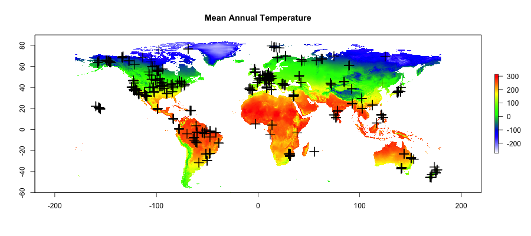
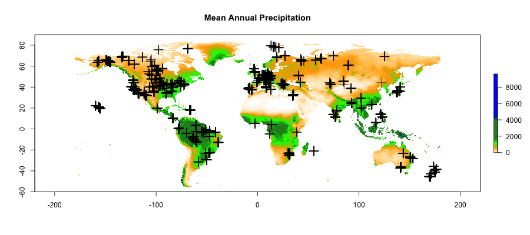

## Contact
For questions about the soilcarbon package email Grey - greymonroe@gmail.com. 

## Database structure


## Database template
[Template file](https://github.com/powellcenter-soilcarbon/soilcarbon/raw/master/inst/extdata/Master_template.xlsx) (Variables with red column names are required)  
[Template instructions](/site_files/Template_info.html)

## Add data!

[Check your data here](http://powellcenter-soilcarbon.ocpu.io/soilcarbon/www/)

1. Install latest version of R [https://www.r-project.org/](https://www.r-project.org/)
2. Install and load soilcarbon package (run this in R). Installing the package this way may not have have the most updated features of the package.
```{r}
install.packages("soilcarbon")
```
2. (Alternate) To  install the most recent development version of the package run this line instead.
```{r}
devtools::install_github("powellcenter-soilcarbon/soilcarbon”)
```
3. Run soilcarbon shiny workbench in R
```{r}
library(soilcarbon)
soilcarbon.shiny()
```
4. Click 'Browse' and chose the data file (Template file that you have filled with data) 
5. Click 'download quality control report' 
6. Look at the text file that is downloaded. Warning messages will describe any problems in the data file.
7. If your data passes the check, email it to powellcenter.soilcarbon@gmail.com.

### Current data
The current version of the publicly available Soil Radiocarbon Database includes data compiled through the efforts of two previous studies. If you access data from this repository, please cite the following references:

He, Y., Trumbore, S. E., Torn, M. S., Harden, J. W., Vaughn, L. J. S., Allison, S. D., & Randerson, J. T. Radiocarbon constraints imply reduced carbon uptake by soils during the 21st century. Science, 355(6306), 1419–1424. http://doi.org/10.1126/science.aag0262

Mathieu, J. A., Hatté, C., Balesdent, J., & Parent, É. (2015). Deep soil carbon dynamics are driven more by soil type than by climate: a worldwide meta-analysis of radiocarbon profiles. Global Change Biology, 21(11), 4278–4292. http://doi.org/10.1111/gcb.13012"

A detailed list of the data sources that are included can be found here:
[Datasets and doi numbers available and in progress](/site_files/make_current_dataset_list.html) 





## Contribute to soilcarbon package
[Instructions for making pull requests](pull-requests).

The Soil Carbon Database has been developed in collaboration between the U.S. Geological Survey Powell Center and the Max Planck Institute for Biogeochemistry”
