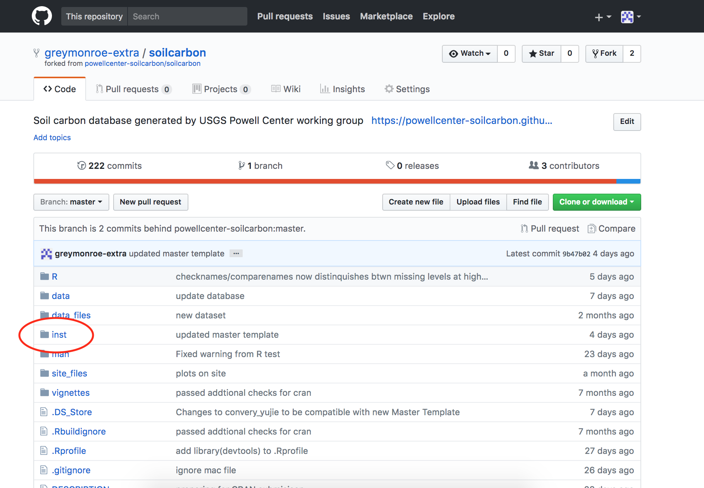

## Contribute to soilcarbon package (making pull request)

This is a tutorial showing how to make a pull request. This is an example for making changes to the Template_info.xlsx file specifically. There are other ways to make pull requests but this is meant to show the simplest method.

#### Follow these steps:

### 1. Make a fork
After you are logged into your github account, navigate to https://github.com/powellcenter-soilcarbon/soilcarbon and create a new Fork. You will now have a copy of the repository in your personal github.

### 2. Navigate to the folder where you want to change files
Now that you are in your personal version of the repositroy, navigate to the directory within the repositry where you want to make changes. In this tutorial we make our way to the /inst/ folder.

### 3. Navigate to the folder where you want to change files 
In this tutorial we make our way next to the /inst/extdata/ folder.

### 4. Upload file
We now navigate to the page where we can upload a file that we have changed. In this case it will be Template_info.xlsx

### 5. Upload file and annotate the changes
Follow the guide on the image below to: [1] Drag (or choose) the file. [2] Provide a brief description of the change [3] Provide a more detailed explanation of the changes that have been made and [4] and commit this change to your repository.

### 6. Repeat steps 2-5 
You can make many changes before you submit a pull request. A single pull request can include multiple commits. 

You can also edit files directly (skipping the file upload steps) by clicking on a file in the git repository on your browser. You then click the edit button which is a pencil icon. You will still commit your changes with a descriptive title and details (parts 2,3,4 on image in step 5 above )

### 7. Make pull request
Now you need to request that the changes you made be added to the official soilcarbon repository. This is called a pull request.

### 8. Create pull request
From this page you can see the base fork that you are requesting to pull your changes (powellcenter-soilcarbon/soilcarbon), the head fork (your fork, in this case greymonroe-extra/soilcarbon) and some information about the changes that have been made in the Commits sections. You're ready to create a pull request, so click the circled button.

### 9. Describe changes
You now have the chance to add any additional information about the changes that have been made. Maintainers will use this information to decide whether to accept the pull request. Add as much information as you think is needed to fully understand the changes that were made. When you're ready click 'Create pull request.'

### 10. Voila!
Nice job! You have now made a pull request with the changes that you contributed to the repository. Maintainers will be notified and your pull request will be posted to https://github.com/powellcenter-soilcarbon/soilcarbon/pulls.  

### All done! The maintainers may accept your pull request or respond with questions. 

If you want to make multiple pull requests, I would recommend spending some time learning about git. Here are some links to help...

[https://www.thinkful.com/learn/github-pull-request-tutorial/](https://www.thinkful.com/learn/github-pull-request-tutorial/)

[https://gist.github.com/Chaser324/ce0505fbed06b947d962](https://gist.github.com/Chaser324/ce0505fbed06b947d962)

